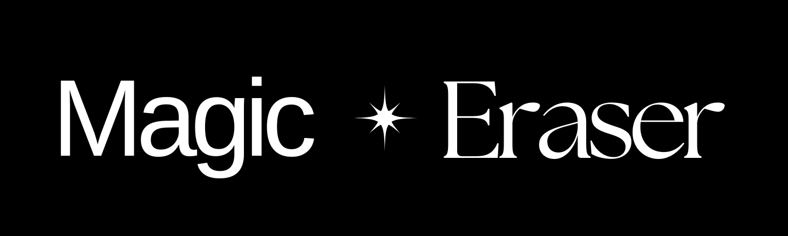

Here's a `README.md` file for your Magic Eraser Tool GitHub repository:

```markdown
# Magic Eraser Tool 🪄

Remove unwanted objects from your images with AI-powered inpainting!

[](https://your-app-url.streamlit.app/)  <!-- Replace with your actual deployment URL -->

## Features ✨

- Simple brush-based interface to mark areas for removal
- AI-powered inpainting technology
- Preserves original image quality
- Adjustable brush size for precise editing
- Download your edited images with one click

## How It Works 🛠️

1. Upload an image (JPG/PNG)
2. Use the brush tool to mark areas you want to remove
3. Click "Submit" and let AI work its magic
4. Download your cleaned image

## Installation 💻

To run locally:

```bash
git clone https://github.com/PRITHIVSAKTHIUR/Magic-Eraser-Tool.git
cd Magic-Eraser-Tool
pip install -r requirements.txt
streamlit run app.py
```

## Requirements 📋

- Python 3.7+
- Streamlit
- NumPy
- Pillow
- pandas
- Other dependencies (see requirements.txt)

## Screenshots 📸

  <!-- Replace with actual screenshot path -->

## Contributing 🤝

Contributions are welcome! Please open an issue or submit a pull request.

## License 📄

This project is licensed under the MIT License - see the [LICENSE](LICENSE) file for details.

```

Key points about this README:
1. Includes all standard sections (Features, Installation, etc.)
2. Uses emojis for visual appeal
3. Has placeholders for your actual deployment URL and screenshot
4. Clear instructions for local setup
5. Professional yet approachable tone

You should also:
1. Add a LICENSE file (MIT is good for open source)
2. Include actual screenshots in the assets folder
3. Update the requirements.txt with all your dependencies
4. Consider adding a demo GIF showing the tool in action

Would you like me to modify any part of this README or add additional sections?
